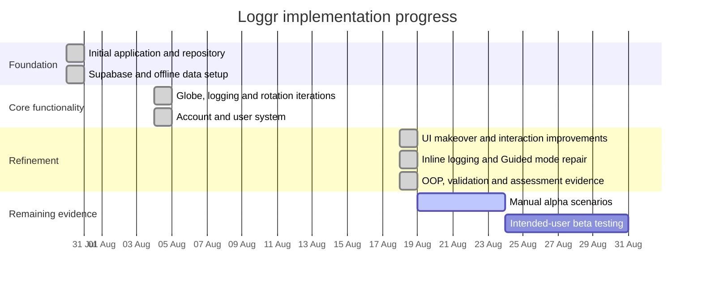

# Gantt progress and annotations

This timeline uses dates present in Git history rather than reconstructed or invented dates.

## Progress annotations

| Date | Planned focus | Actual progress / annotation | Evidence |
|---|---|---|---|
| 2026-07-30 | Establish the product foundation | Created the application, data model, Supabase setup and initial globe/logger. | Git history from `Initial push` through setup and bug-fix commits. |
| 2026-08-04 | Implement and debug core functionality | Iterated globe behavior, added tests, protected secrets and implemented the user system. Several rotation/facelift revisions show debugging and correction rather than a single untested pass. | Git commits dated 2026-08-04 and globe tests. |
| 2026-08-18 | Improve usability | Redesigned the interface, replaced new-contact popups with inline logging, added Hunt/Stay behavior and restored Guided mode. | UI commits, browser screenshots and logging tests. |
| 2026-08-18 | Meet Lesson 4 OOP/documentation criteria | Integrated domain classes, private fields, inherited frequency policies, polymorphic behavior, existence validation and evidence documentation. | Domain/validation tests and this checklist. |
| Next | Complete human evidence | Run every pending manual alpha scenario, attach viewport/service screenshots, fix defects, then conduct the beta plan with intended users. | `alpha-testing.md` and `beta-test-plan.md`. |

Update this table whenever a task changes scope, slips, completes, or uncovers a defect. Link the related commit, test output, screenshot, or feedback record.
